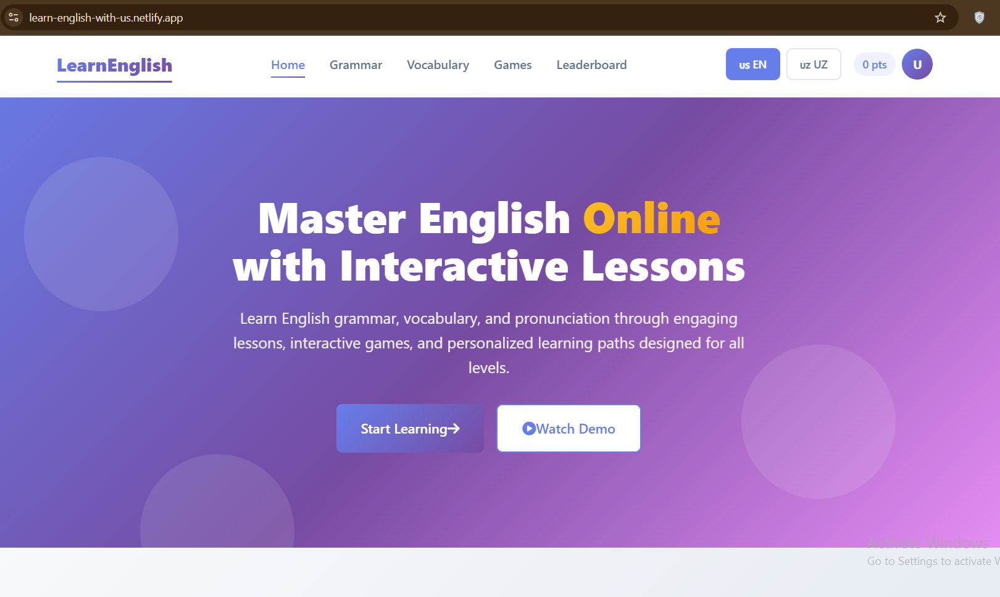
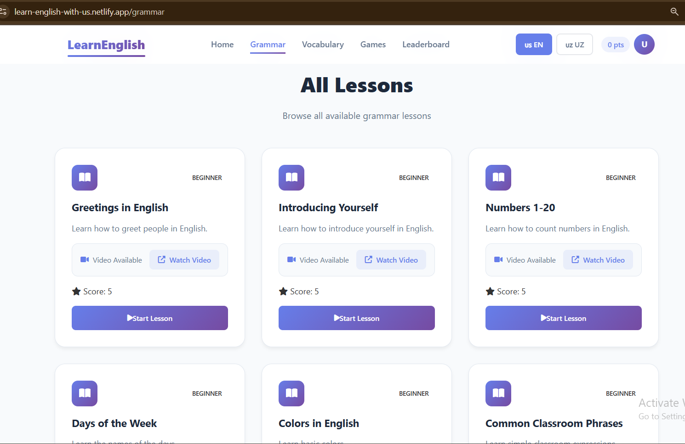
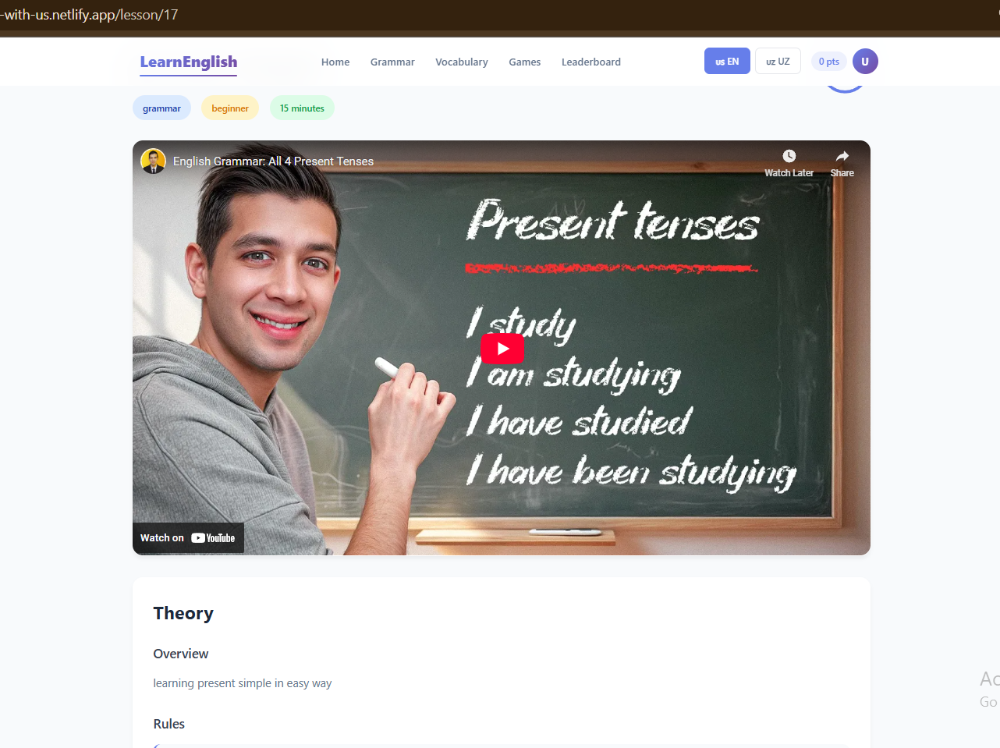
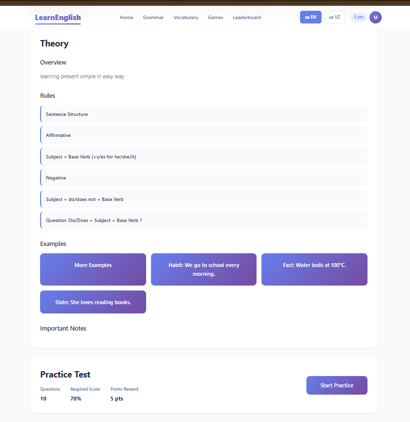
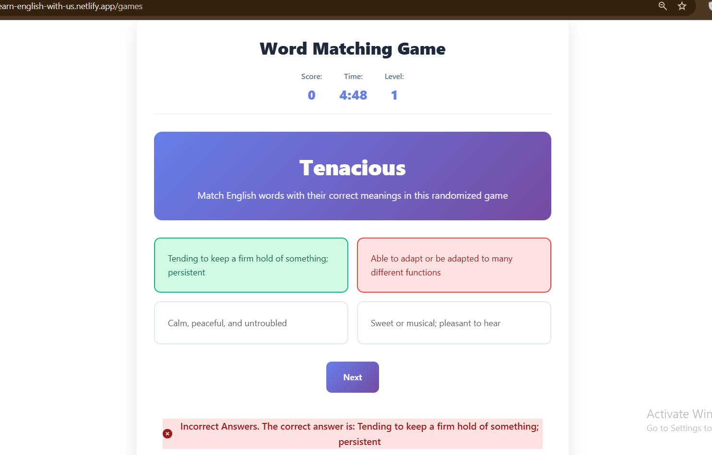
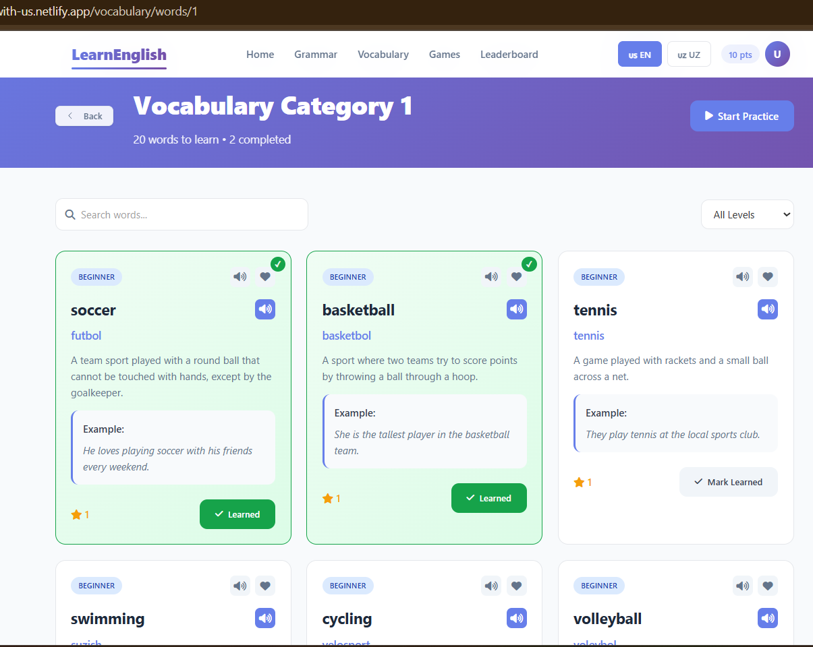
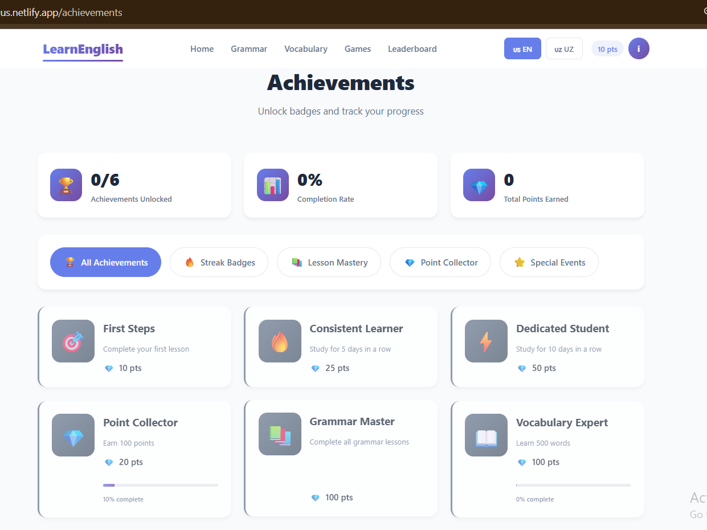
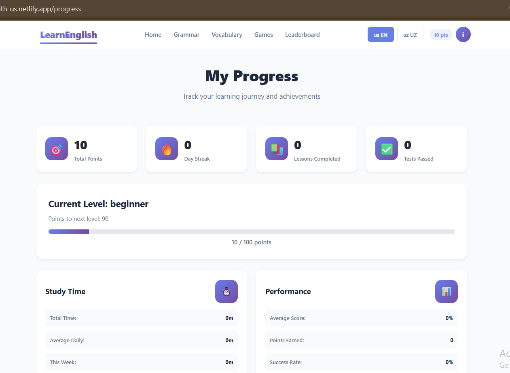
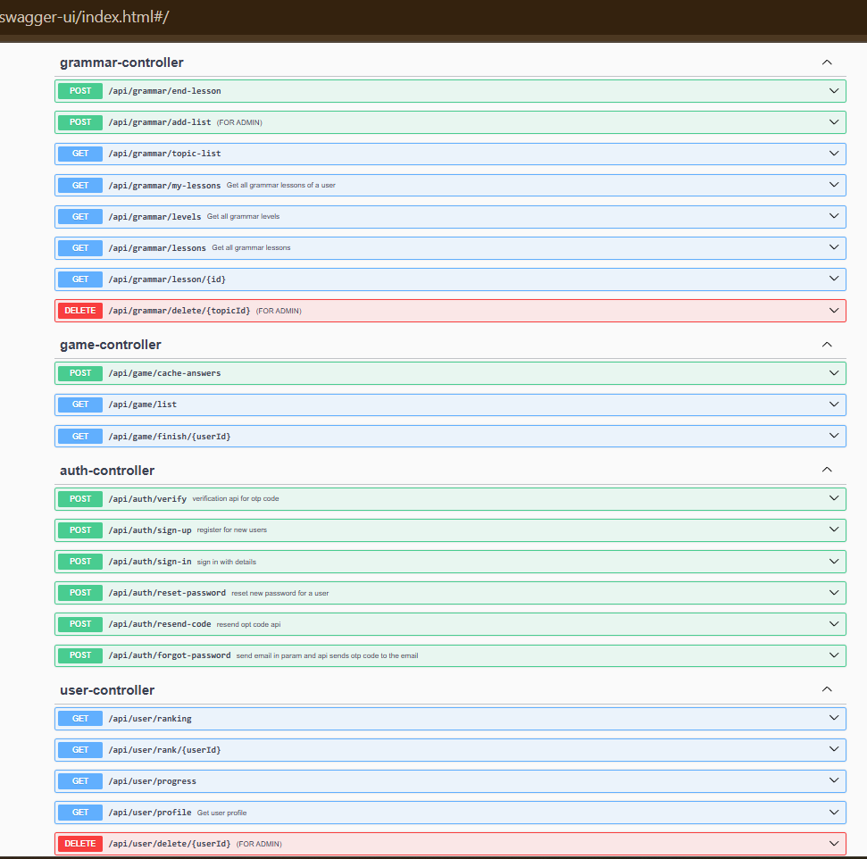

# Lang-Master 📘✨

**Lang-Master** is a full-featured **language learning platform** built with **Spring Boot 3.5.4** and **Java 21**.  
It combines grammar lessons, video tutorials, vocabulary building, quizzes, and gamified exercises to make learning languages engaging and effective.  
With PostgreSQL for persistence, Redis for caching, and JWT-based security, the platform is both **scalable** and **secure**.

---

## 🚀 Features

- 📹 **Grammar & Video Lessons** — structured grammar explanations and video tutorials
- 📝 **Vocabulary Builder** — learn and review words with personalized lists
- ❓ **Interactive Quizzes** — course-based test modules to check progress
- 📊 **User Progress Tracking** — monitor daily activity and streaks
- 🎮 **Gamified Learning** — mini-games to boost motivation:
    - Word Match
    - Synonym & Antonym Race

---

## 🛠️ Tech Stack

- **Backend Framework:** Spring Boot 3.5.4
- **Language:** Java 21 (Virtual Threads for concurrency)
- **Database:** PostgreSQL
- **Caching & Session Management:** Redis
- **Security:** Spring Security + JWT
- **CI/CD:** used GitHub Actions for automating testing and deploying
- **Build Tool:** Gradle
- **Object Mapping:** MapStruct & ModelMapper
- **Documentation:** Springdoc OpenAPI (Swagger UI)
- **Validation:** Jakarta Validation & Hibernate Validator
- **Others:**
    - Spring Mail (email service)
    - ZXing (QR code generation)

* Home page short described the platform


* Grammars page including all available lessons here


* Video lesson page
  

* Video lesson page
  

* Game page
  

* Vocabulary page
  

* User achievement tracking page
  

* User progress page
  

* Backend swagger-document
  
  


## 🌐 Live Demo

You can try the project here: [Lang Master Website](https://learn-english-with-us.netlify.app)
---

## ⚙️ Getting Started

### Prerequisites
- JDK 21+
- PostgreSQL (configured in `application.yml`)
- Redis server running locally

### Installation
```bash
# Clone the repository
git clone https://github.com/islom0202/lang-master.git
cd lang-master

# Build the project
./gradlew build

# Run the project
./gradlew bootRun


## 📂 Project Repository

Projectni shu yerda topishingiz mumkin:  
👉 [Lang Master GitHub Repository](https://github.com/islom0202/lang-master)
